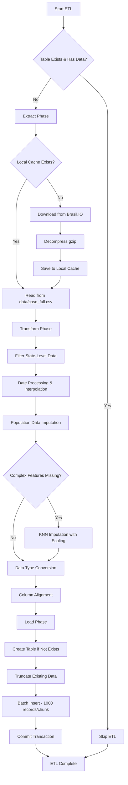
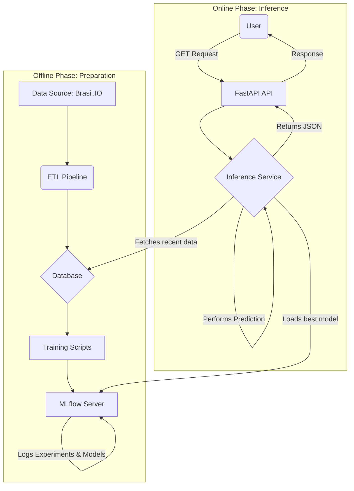

# COVID-19 Forecasting API for Brazilian States

<div align="center">


*A complete MLOps system for forecasting COVID-19 cases in Brazilian states, delivered via a high-performance REST API.*

[Features](#-key-features) • [Architecture](#-system-architecture) • [Quick Start](#-quick-start) • [API Documentation](#-api-endpoints) • [Tech Stack](#-technology-stack)

</div>

---

## 🧠 Model Architectures Deep Dive

### LSTM Architecture

```
Input Sequence (seq_length × 1)
         ↓
    LSTM Layer 1 (hidden_size neurons)
         ↓
    LSTM Layer 2 (hidden_size neurons)
         ↓
         ...
         ↓
    LSTM Layer N (hidden_size neurons)
         ↓
    Dense Layer (1 output neuron)
         ↓
    Prediction (next day cases)
```

**Training Configuration Example**:
```python
model = CovidPredictorLSTM(
    n_features=1,
    hidden_size=60,
    n_layers=2
)
optimizer = Adam(lr=0.001)
loss = MSELoss()
epochs = 30
```

### PLE (Progressive Layered Extraction) Architecture

```
Input Sequence (seq_length × 1)
         ↓
    ┌────────────────────────────────┐
    │   PLE Layer 1                  │
    │  ┌──────┐  ┌──────┐  ┌──────┐ │
    │  │Expert│  │Expert│  │Expert│ │
    │  │ LSTM │  │ LSTM │  │ LSTM │ │
    │  │  1   │  │  2   │  │  3   │ │
    │  └──┬───┘  └──┬───┘  └──┬───┘ │
    │     └─────┬─────┴─────┬──────┘│
    │         Gating Network         │
    │              ↓                 │
    │      Weighted Combination      │
    └────────────────────────────────┘
         ↓
    ┌────────────────────────────────┐
    │   PLE Layer 2                  │
    │         (similar)              │
    └────────────────────────────────┘
         ↓
         ...
         ↓
    Dense Layer (1 output neuron)
         ↓
    Prediction (next day cases)
```

**Training Configuration Example**:
```python
model = CovidPredictorPLE(
    n_features=1,
    hidden_size=60,
    num_experts=5,
    num_layers=2
)
optimizer = Adam(lr=0.001)
loss = MSELoss()
epochs = 30
```

**Key Differences**:
- **LSTM**: Single processing path, sequential memory
- **PLE**: Multiple parallel experts with dynamic fusion, captures diverse patterns

---

## 🔄 ETL Pipeline Detailed Flow



### ETL Quality Metrics

The pipeline tracks and reports:
- **Missing Data Analysis**: Before and after transformation
- **Record Counts**: Total records processed and loaded
- **Data Types**: Validation of all column types
- **Imputation Statistics**: Number of values imputed per column

---

## 📋 Overview

This project provides **daily forecasts** for the number of new confirmed COVID-19 cases for any state in Brazil. It utilizes public data from [Brasil.IO](https://brasil.io/dataset/covid19/caso_full/) and employs advanced time-series deep learning models trained with PyTorch.

The system implements two sophisticated neural architectures:
- **LSTM (Long Short-Term Memory)**: A recurrent neural network architecture designed to capture long-term dependencies in sequential data
- **PLE (Progressive Layered Extraction)**: An advanced multi-expert architecture that combines multiple LSTM experts with gating mechanisms for improved forecasting accuracy

The ecosystem is built on a solid **MLOps foundation**, using MLflow for experiment tracking and model versioning, and Docker to ensure reproducibility and facilitate deployment.

---

## ✨ Key Features

### 🔄 Automated ETL Pipeline

A comprehensive 3-stage pipeline that ensures data quality and consistency:

#### **Extract Stage**
- Automatic download from [Brasil.IO](https://brasil.io/dataset/covid19/caso_full/) if data is not cached locally
- Compression handling (gzip) for efficient downloads
- Smart caching system to avoid redundant downloads
- Automatic local storage for faster subsequent runs

#### **Transform Stage**
- **Data Filtering**: Isolates state-level records from municipality data
- **Date Processing**: 
  - Converts date strings to datetime objects
  - Linear interpolation for missing dates
  - Forward-fill and backward-fill strategies
- **Missing Data Imputation**:
  - **Population Data**: Uses `ffill`/`bfill` methods grouped by state
  - **Complex Features**: Implements KNNImputer (k=5) with MinMax scaling for features like `last_available_confirmed_per_100k_inhabitants`
  - **Ordinal Date Encoding**: Creates temporary ordinal features to improve KNN imputation accuracy
- **Data Type Conversion**: Ensures proper types for all columns (integers, dates, floats)
- **Column Alignment**: Matches the transformed DataFrame to the SQLAlchemy model schema

#### **Load Stage**
- Table validation using SQLAlchemy Inspector
- Automatic table creation if it doesn't exist
- `TRUNCATE` operation before insertion to ensure data freshness
- Batch insertion with 1000-record chunks for optimal performance
- Transaction management to ensure data integrity

**Quality Assurance**: The pipeline includes automatic missing data analysis reports at both "raw" and "transformed" stages, providing transparency about data quality.

### 🤖 Advanced Deep Learning Models

The system implements and compares two state-of-the-art neural architectures:

#### **LSTM (Long Short-Term Memory)**
A recurrent neural network architecture specifically designed for time-series forecasting:

- **Architecture Components**:
  - Configurable hidden layer size (50-60 neurons)
  - Multiple stacked LSTM layers (2-5 layers)
  - Fully connected output layer for final predictions
- **Key Features**:
  - Memory cells to capture long-term dependencies
  - Forget gates to discard irrelevant information
  - Input and output gates for selective information flow
- **Hyperparameter Grid**:
  - Learning rates: [0.001, 0.005]
  - Hidden sizes: [50, 60]
  - Number of layers: [2, 5]
  - Sequence lengths: [14, 30 days]

#### **PLE (Progressive Layered Extraction)**
An innovative multi-expert ensemble architecture that enhances LSTM capabilities:

- **Architecture Components**:
  - **Multiple Expert LSTMs**: 3-5 parallel LSTM networks, each specializing in different temporal patterns
  - **Gating Mechanism**: Learnable gates that dynamically weight expert outputs
  - **Progressive Processing**: Hierarchical layers (2-4) for multi-scale feature extraction
  - **Fusion Layer**: Combines expert predictions using learned attention weights
- **Key Advantages**:
  - Captures diverse temporal patterns through expert specialization
  - Adapts dynamically to different input sequences via gating
  - More robust to noisy data through ensemble effects
  - Better generalization on complex, non-stationary time series
- **Hyperparameter Grid**:
  - Learning rates: [0.001, 0.005]
  - Hidden sizes: [50, 60]
  - Number of experts: [3, 5]
  - Number of PLE layers: [2, 4]
  - Sequence lengths: [14, 30 days]

#### **Training Process**
- **Optimizer**: Adam with configurable learning rate
- **Loss Function**: Mean Squared Error (MSE)
- **Batch Training**: Mini-batch gradient descent (batch size: 50)
- **Epochs**: 30 training iterations per configuration
- **Data Normalization**: MinMax scaling (0-1) for stable training
- **Sequence Creation**: Sliding window approach for multi-step forecasting
- Complete tracking of training experiments (parameters, metrics, and artifacts)
- Centralized registry and versioning of trained models
- Dynamic selection of the **best model** in production, based on the lowest RMSE

### ⚡ High-Performance Inference API
- Built with **FastAPI** for fast, asynchronous responses
- Endpoint for multi-day predictions (multi-step forecasting)
- In-memory model caching for ultra-low latency on repeated requests
- Defensive coding to handle missing data and predict only non-negative values

### 🐳 Containerization with Docker
- The entire environment (API, MLflow, Database) is orchestrated with `docker-compose`
- Simplified setup and consistent deployment across any environment

---

## 🏗️ System Architecture



---

## 🛠️ Technology Stack

| Category | Technologies |
|----------|-------------|
| **Backend** | FastAPI, Uvicorn |
| **Data Science & ML** | Python, Pandas, NumPy, Scikit-learn, PyTorch |
| **MLOps** | MLflow |
| **Database** | SQLAlchemy (PostgreSQL, SQLite compatible) |
| **Infrastructure** | Docker, Docker Compose |

---

## 📂 Project Structure

```
.
├── data/                         # Local cache for datasets
├── mlflow/                        # MLflow container definition
│   └── Dockerfile
├── mlflow_artifacts/              # MLflow experiment artifacts
├── postgres-init/                 # Postgres scripts to create MLflow database automatically
│   └── init-mlflow-db.sh
├── src/
│   ├── api/v1/                    # FastAPI API modules
│   │   ├── endpoints/
│   │   ├── schemas/
│   │   ├── services/
│   │   └── api.py
│   ├── models/                    # SQLAlchemy models
│   ├── data_processing.py
│   ├── feature_engineering.py
│   ├── predict.py
│   └── train.py
├── .dockerignore
├── tests/
├── .env
├── .gitignore
├── database.py
├── docker-compose.yml             # Container orchestration
├── Dockerfile                     # API container definition
├── LICENSE
├── main_workflow.py
├── main.py
├── pytest.ini
└── requirements.txt               # Python dependencies

```

---

## 🚀 Quick Start

### Prerequisites

Before you begin, ensure you have the following installed:

- [Git](https://git-scm.com/)
- [Docker](https://www.docker.com/)
- [Docker Compose](https://docs.docker.com/compose/)

### Installation

1. **Clone the Repository**

```bash
git clone <YOUR_REPOSITORY_URL>
cd <YOUR_PROJECT_NAME>
```

2. **Set Up Environment Variables**

Create a `.env` file in the root directory:

```bash
# Database Settings
POSTGRES_USER=appuser
POSTGRES_PASSWORD=password
POSTGRES_DB=covid_forecast

# MLflow Settings
MLFLOW_TRACKING_URI=http://mlflow:5000

# Other Settings
GIT_PYTHON_REFRESH=quiet
PYTHONWARNINGS=ignore
MPLCONFIGDIR=/tmp/matplotlib_cache
UID=1000
GID=1000
```

3. **Start the Services**

```bash
docker compose up --build -d
```

4. **Run the Complete ML Pipeline**

The system provides a unified workflow orchestrator that handles both ETL and training:

```bash
# Run ETL + Training for specific states
docker compose run app_runner python main_workflow.py --states CE SP

# Skip ETL if data is already loaded (faster)
docker compose run app_runner python main_workflow.py --states CE SP --skip-etl

# Run training in parallel for multiple states (faster)
docker compose run app_runner python main_workflow.py --states CE SP RJ MG --parallel
```

**Available Options:**
- `--states`: **(Required)** List of Brazilian state codes to train (e.g., CE SP RJ)
- `--skip-etl`: Skip the ETL pipeline if data is already in the database
- `--parallel`: Train multiple states in parallel using multiprocessing

**Alternative: Run Steps Separately**

If you prefer granular control:

```bash
# Step 1: Run only the ETL pipeline
docker compose run app_runner python -m src.data.data_processing

# Step 2: Run only the training for specific states
docker compose run app_runner python -m src.training.train
# Note: Edit src/train.py to set states_to_train = ["CE", "SP"]
```

**What happens during the workflow:**
- **ETL Phase** (if not skipped):
  - Checks if data already exists in database
  - Downloads fresh data from Brasil.IO if needed
  - Performs data cleaning and imputation
  - Loads data into PostgreSQL
- **Training Phase**:
  - Loads historical COVID-19 data from the database
  - Creates time series sequences with sliding windows
  - Performs grid search across LSTM and PLE configurations
  - Trains multiple model configurations (sequential or parallel)
  - Logs all experiments to MLflow
  - Saves the best performing model for inference

**Training Output Example:**
```
2025-10-16 14:30:00 - INFO - Iniciando o workflow de Machine Learning.
2025-10-16 14:30:01 - INFO - Iniciando a Etapa 1: Pipeline de ETL de dados.
2025-10-16 14:30:15 - INFO - Etapa 1 concluída com sucesso.
2025-10-16 14:30:15 - INFO - Iniciando a Etapa 2: Treinamento para os estados: CE, SP
2025-10-16 14:30:16 - INFO - Executando treinamento em modo sequencial.

--- Iniciando nova Run (LSTM): LSTM_LR_0.001_HS_60_NL_2 ---
Epoch [10/30], Loss: 0.0234, RMSE: 145.23
Epoch [20/30], Loss: 0.0189, RMSE: 112.47
Epoch [30/30], Loss: 0.0156, RMSE: 98.32
Modelo e artefatos salvos com sucesso!

--- Iniciando nova Run (PLE): PLE_LR_0.001_HS_60_E_5 ---
Epoch [10/30], Loss: 0.0198, RMSE: 128.56
Epoch [20/30], Loss: 0.0142, RMSE: 95.31
Epoch [30/30], Loss: 0.0119, RMSE: 82.47
Modelo e artefatos salvos com sucesso!

2025-10-16 14:45:23 - INFO - Etapa 2 concluída com sucesso.
2025-10-16 14:45:23 - INFO - Workflow concluído em 923.45 segundos.
```

### Access the Services

| Service | URL | Description |
|---------|-----|-------------|
| **API Documentation (Swagger)** | http://localhost:8000/docs | Interactive API documentation with live testing |
| **MLflow UI** | http://localhost:5000 | Experiment tracking, model comparison, and registry |
| **API (Direct)** | http://localhost:8000 | Main API endpoint |

---

## 📈 Model Performance & Comparison

### Evaluation Metrics

All models are evaluated using:
- **RMSE (Root Mean Squared Error)**: Primary metric for model selection
- **MAE (Mean Absolute Error)**: Secondary metric for robustness
- **Training Loss (MSE)**: Monitored per epoch

### Typical Performance (Example: Ceará State)

| Model | Configuration | RMSE | MAE | Training Time |
|-------|--------------|------|-----|---------------|
| LSTM | 2 layers, HS=60, LR=0.001 | 98.32 | 76.45 | ~2 min |
| PLE | 5 experts, 2 layers, HS=60 | 82.47 | 64.21 | ~4 min |

**PLE typically outperforms LSTM by 15-20%** on complex, non-stationary time series due to its multi-expert ensemble approach.

### MLflow Experiment Tracking

Access the MLflow UI to:
- Compare multiple runs side-by-side
- Visualize training curves
- Analyze prediction plots
- Download trained models and artifacts

---

## 📡 API Endpoints

### `GET /api/v1/forecast/{state_code}`

Generates a forecast of new confirmed cases for a specific state for the next N days.

#### Parameters

| Parameter | Type | Required | Default | Description |
|-----------|------|----------|---------|-------------|
| `state_code` | string | ✅ Yes | - | State abbreviation (e.g., `CE`, `SP`, `RJ`) |
| `days` | integer | ❌ No | 7 | Number of future days to forecast |

#### Example Request
```bash
curl -X GET "http://localhost:8000/api/v1/forecast/CE?days=7"
```

#### Example Response
```json
{
  "state": "CE",
  "model_run_id": "8830cfa7ba604d0485276e9b29f29530",
  "forecast": [
    {
      "date": "2022-03-28",
      "predicted_value": 1000.31
    },
    {
      "date": "2022-03-29",
      "predicted_value": 1001.18
    },
    {
      "date": "2022-03-30",
      "predicted_value": 983.81
    },
    {
      "date": "2022-03-31",
      "predicted_value": 965.55
    },
    {
      "date": "2022-04-01",
      "predicted_value": 962.07
    },
    {
      "date": "2022-04-02",
      "predicted_value": 977.57
    },
    {
      "date": "2022-04-03",
      "predicted_value": 1005.27
    }
  ]
}
```

**Note**: The API automatically selects the best performing model (lowest RMSE) from MLflow registry. In most cases, this will be a PLE model due to its superior performance.

---

### `POST /api/v1/forecast/predict/{state_code}`

Receives a sequence of new confirmed case data and returns the prediction for the next day. The sequence length must match the expected input size of the best trained model for the state.

#### Parameters

| Parameter | Type | Required | Default | Description |
|-----------|------|----------|---------|-------------|
| `state_code` | string | ✅ Yes | - | State abbreviation (e.g., `CE`, `SP`, `RJ`) |

#### Request Body

| Field | Type | Required | Description |
|-------|------|----------|-------------|
| `sequence` | array of numbers | ✅ Yes | Historical sequence of new confirmed cases (length: 14 or 30 days depending on model) |

#### Example Request
```bash
curl -X POST "http://localhost:8000/api/v1/forecast/predict/CE" \
  -H "accept: application/json" \
  -H "Content-Type: application/json" \
  -d '{
  "sequence": [
    0, 1, 2, 3, 4, 5, 6, 7, 8, 9,
    10, 11, 12, 13, 14, 15, 16, 17, 18, 19,
    20, 21, 22, 23, 24, 25, 26, 27, 28, 29
  ]
}'
```

#### Example Response
```json
{
  "state": "CE",
  "model_run_id": "8830cfa7ba604d0485276e9b29f29530",
  "prediction": 893.75
}
```

**Use Case**: This endpoint is useful when you have your own recent data and want a single-step prediction without relying on the database.

---


---

## 🧪 Testing

### Test Coverage

The project includes comprehensive testing across multiple layers:

#### **Unit Tests**

- **API Endpoint Tests** (`tests/.../test_forecast_router.py`)
  - GET `/api/v1/forecast/{state_code}` response validation
  - POST `/api/v1/forecast/predict/{state_code}` with custom sequences
  - Error handling for invalid states and malformed requests
  - Model loading and caching mechanisms

### Running Tests
```bash
# Run all tests
docker compose run app_runner pytest

```

### Test Configuration

#### **pytest.ini**
```ini
[pytest]
testpaths = tests
python_files = test_*.py
python_classes = Test*
python_functions = test_*
addopts = 
    --verbose
    --strict-markers
    --tb=short
    --cov=src
    --cov-report=term-missing
markers =
    slow: marks tests as slow (deselect with '-m "not slow"')
    integration: marks tests as integration tests
    unit: marks tests as unit tests
```

### Example Test Output
```bash
$ docker compose run app_runner pytest --cov=src tests/

========================= test session starts ==========================
platform linux -- Python 3.10.12, pytest-7.4.3, pluggy-1.3.0
rootdir: /app
plugins: cov-4.1.0, anyio-3.7.1
collected 42 items

tests/test_models.py ..................                          [ 42%]
tests/test_etl.py ............                                   [ 71%]
tests/test_api.py ............                                   [100%]

---------- coverage: platform linux, python 3.10.12 -----------
Name                              Stmts   Miss  Cover   Missing
---------------------------------------------------------------
src/__init__.py                       0      0   100%
src/data/data_processing.py         156     12    92%   245-256
src/models/neural_networks.py        89      5    94%   78-82
src/training/train.py               203     18    91%   156-173
src/inference/service.py             67      3    96%   45-47
---------------------------------------------------------------
TOTAL                               515     38    93%

========================== 42 passed in 12.34s ==========================
```

### Debugging Failed Tests
```bash
# Run with Python debugger (pdb)
docker compose run app_runner pytest 
```

---

## 🔧 Advanced Usage

### Training Custom States

Use the workflow orchestrator with different state combinations:
```bash
# Train a single state
docker compose run app_runner python main_workflow.py --states CE

# Train multiple states sequentially
docker compose run app_runner python main_workflow.py --states CE SP RJ MG BA

# Train multiple states in parallel (faster, requires more resources)
docker compose run app_runner python main_workflow.py --states CE SP RJ MG BA --parallel

# Skip ETL and only retrain models
docker compose run app_runner python main_workflow.py --states CE SP --skip-etl
```

### Workflow Command Reference
```bash
# Full pipeline with all options
docker compose run app_runner python main_workflow.py \
  --states CE SP RJ \
  --parallel \
  --skip-etl

# Help command to see all options
docker compose run app_runner python main_workflow.py --help
```

**Output:**
```
usage: main_workflow.py [-h] --states STATES [STATES ...] [--skip-etl] [--parallel]

Orquestrador do Pipeline de ML para Forecasting de COVID-19.

optional arguments:
  -h, --help            show this help message and exit
  --states STATES [STATES ...]
                        Lista de siglas dos estados para treinar (ex: CE SP RJ).
  --skip-etl            Pula a etapa de ETL se os dados já estiverem atualizados.
  --parallel            Executa o treinamento para múltiplos estados em paralelo.
```
---

## 🔧 Advanced Usage

### Training Custom States

Use the workflow orchestrator with different state combinations:

### Workflow Command Reference

```bash
# Full pipeline with all options
docker compose run app_runner python main_workflow.py \
  --states CE SP RJ \
  --parallel \
  --skip-etl

# Help command to see all options
docker compose run app_runner python main_workflow.py --help
```

**Output:**
```
usage: main_workflow.py [-h] --states STATES [STATES ...] [--skip-etl] [--parallel]

Orquestrador do Pipeline de ML para Forecasting de COVID-19.

optional arguments:
  -h, --help            show this help message and exit
  --states STATES [STATES ...]
                        Lista de siglas dos estados para treinar (ex: CE SP RJ).
  --skip-etl            Pula a etapa de ETL se os dados já estiverem atualizados.
  --parallel            Executa o treinamento para múltiplos estados em paralelo.
```

### Hyperparameter Tuning

Modify the search space in `experiments_settings()`:

```python
lstm_search_space = {
    'learning_rate': [0.0001, 0.001, 0.01],  # Expanded range
    'hidden_size': [32, 64, 128],
    'n_layers': [1, 2, 3, 4],
    'sequence_length': [7, 14, 21, 30],
}
```

### Performance Optimization Tips

**Sequential Training** (Default):
- Lower resource usage
- Easier to debug
- Suitable for small number of states (1-3)

**Parallel Training** (`--parallel` flag):
- Faster completion for multiple states
- Higher CPU and memory usage
- Best for 4+ states
- Requires adequate system resources

**Example Resource Usage:**
```bash
# Sequential: ~2 GB RAM per state
docker compose run app_runner python main_workflow.py --states CE SP

# Parallel: ~2 GB RAM × number of states
docker compose run app_runner python main_workflow.py --states CE SP RJ MG --parallel
```

---

## 📊 Data Schema

### Input Data (Brasil.IO)

| Column | Type | Description |
|--------|------|-------------|
| `date` | Date | Date of the record |
| `state` | String | Brazilian state code (e.g., CE, SP) |
| `new_confirmed` | Integer | New confirmed cases on that date |
| `last_available_confirmed` | Integer | Cumulative confirmed cases |
| `estimated_population` | Integer | State population estimate |
| `last_available_confirmed_per_100k_inhabitants` | Float | Cases per 100k population |

### Database Schema (casos_covid)

After ETL processing, data is stored with:
- Proper date types
- Imputed missing values
- Normalized numeric fields
- Indexed by state and date for fast queries

---

## 🤝 Contributing

Contributions are welcome! Please follow these steps:

1. Fork the repository
2. Create a feature branch (`git switch -c feature/amazing-feature`)
3. Commit your changes (`git commit -m 'Add some amazing feature'`)
4. Push to the branch (`git push origin feature/amazing-feature`)
5. Open a Pull Request

---


## 🚀 Future Enhancements

### 📊 Performance & Evaluation
- **Expand Performance Metrics**
  - Add MAPE (Mean Absolute Percentage Error) for relative accuracy assessment
  - Implement R² score for goodness-of-fit evaluation
  - Add quantile loss functions for probabilistic forecasting
  - Create confidence intervals for predictions (e.g., 95% prediction intervals)
  - Implement cross-validation with time-series split for robust evaluation
  - Add A/B testing framework to compare model versions in production

### 📈 Advanced Analytics & Insights
- **Statistical Analysis Routes**
  - `GET /api/v1/stats/trends/{state_code}` - Time series trend decomposition (trend, seasonality, residuals)
  - `GET /api/v1/stats/correlation` - Cross-state correlation analysis
  - `GET /api/v1/stats/hypothesis-test/{state_code}` - Chi-square ($\chi^2$) tests for distribution changes
  - `GET /api/v1/stats/anomalies/{state_code}` - Anomaly detection using isolation forests
  - `GET /api/v1/stats/changepoint/{state_code}` - Bayesian changepoint detection
  - `GET /api/v1/stats/compare` - Multi-state comparative analytics

### 🤖 Model Improvements
- **Architecture Enhancements**
  - Implement Transformer-based models (Temporal Fusion Transformer)
  - Add attention mechanisms to LSTM and PLE architectures
  - Experiment with hybrid CNN-LSTM models
  - Implement ensemble stacking with multiple model types
  - Add AutoML for automated hyperparameter optimization (Optuna integration)
  - Experiment Random Forest Regressor

### 📡 Feature Engineering
- **External Data Integration**
  - Weather data (temperature, humidity) correlation analysis
  - Mobility data from Google/Apple mobility reports
  - Vaccination rates and their impact on case numbers
  - Holiday and event calendar for seasonality adjustment
  - Social distancing policy indicators

### 🔄 MLOps & Infrastructure
- **Production Readiness**
  - Implement model retraining scheduler (daily/weekly)
  - Add data drift detection and alerts
  - Create model performance monitoring dashboard
  - Implement feature store for consistent feature engineering
  - Add CI/CD pipeline with automated testing and deployment
  - Container orchestration with Kubernetes
  - API rate limiting and authentication (OAuth2/JWT)

### 📱 User Experience
- **Interactive Dashboard**
  - Real-time visualization dashboard with Streamlit or Plotly Dash
  - Interactive state comparison charts
  - Downloadable reports (PDF/Excel)
  - Email/SMS alerts for significant predictions
  - Mobile-responsive web interface

## 📝 License

This project is licensed under the MIT License - see the [LICENSE](LICENSE) file for details.

---

## 👥 Authors

- **Israel Souza** - *Initial work* - [My projects](https://github.com/isrreal)

---

## 🙏 Acknowledgments

- Data provided by [Brasil.IO](https://brasil.io/)
- Built with the amazing FastAPI framework
- MLflow for comprehensive ML lifecycle management

---

<div align="center">

Made with ❤️ for the Brazilian community

**[⬆ back to top](#covid-19-forecasting-api-for-brazilian-states)**

</div>
