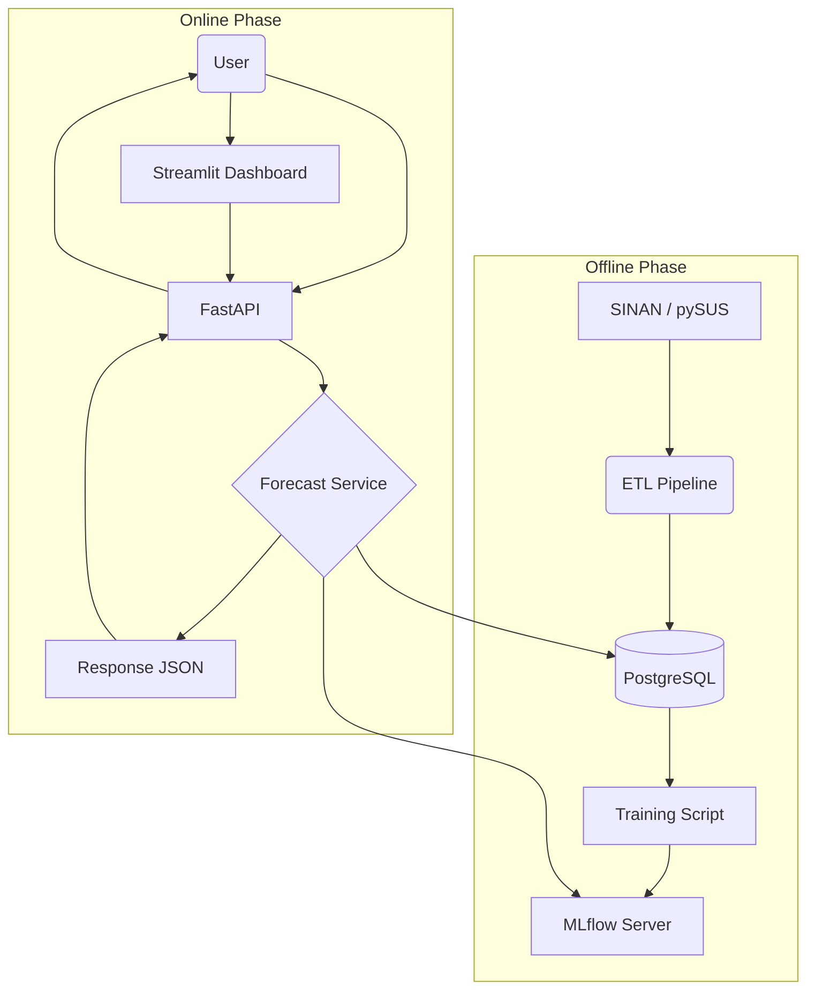
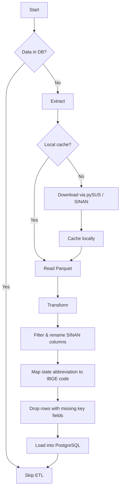

# Dengue Forecasting API for Brazilian States

<div align="center">


*A complete MLOps system for forecasting dengue cases in Brazilian states — from raw SINAN notifications to a REST API and interactive dashboard.*

[Features](#-key-features) • [Architecture](#-system-architecture) • [Quick Start](#-quick-start) • [API Endpoints](#-api-endpoints) • [Tech Stack](#-technology-stack)

</div>

---

## 📋 Overview

This project provides **daily forecasts** of dengue notifications for any Brazilian state. It ingests raw case-level data from [SINAN](https://pysus.readthedocs.io/) via **pySUS** — one row per notification — and aggregates it into daily time series to train deep learning models with PyTorch.

Two neural architectures are implemented and compared:

- **LSTM (Long Short-Term Memory)** — recurrent network designed to capture long-term sequential dependencies
- **PLE (Progressive Layered Extraction)** — multi-expert ensemble architecture combining parallel LSTM experts with learnable gating mechanisms

The system is built on a solid **MLOps foundation**: MLflow for experiment tracking and model versioning, FastAPI for serving predictions, a Streamlit dashboard for visualization, and Docker Compose to orchestrate everything.

---

## ✨ Key Features

- **ETL Pipeline** — downloads SINAN dengue data via pySUS, cleans, and loads into PostgreSQL
- **Grid Search Training** — systematically compares LSTM and PLE across hyperparameter combinations
- **MLflow Tracking** — logs every run's parameters, metrics, and artifacts; auto-selects the best model by validation RMSE
- **REST API** — FastAPI with full Pydantic schemas, response validation, and Swagger documentation
- **Confidence Intervals** — multi-step forecasts with configurable confidence bands
- **Municipality-level Forecasts** — per-municipality and aggregated state forecasts (IBGE codes)
- **Statistical Endpoints** — chi-square tests, confidence intervals, mortality rankings by municipality
- **Streamlit Dashboard** — interactive visualization of forecasts and municipality rankings
- **Automated Tests** — pytest suite covering all API endpoints

---

## 🏗️ System Architecture


```mermaid
flowchart TD
    subgraph "Offline Phase"
        A[SINAN / pySUS] --> B(ETL Pipeline)
        B --> C[(PostgreSQL)]
        C --> D[Training Script]
        D --> E[MLflow Server]
    end

    subgraph "Online Phase"
        F(User) --> G[Streamlit Dashboard]
        F --> H[FastAPI]
        G --> H
        H --> I{Forecast Service}
        I --> E
        I --> C
        I --> J[Response JSON]
        J --> H --> F
    end
```

---

## 🧠 Model Architectures

### LSTM

```
Input Sequence (seq_length × 1)
         ↓
    LSTM Layer 1 (hidden_size neurons)
         ↓
    LSTM Layer 2 (hidden_size neurons)
         ↓
    Dense Layer (1 output)
         ↓
    Prediction (next day notifications)
```

### PLE (Progressive Layered Extraction)

```
Input Sequence (seq_length × 1)
         ↓
    ┌─────────────────────────────────┐
    │  PLE Layer 1                    │
    │  ┌──────┐  ┌──────┐  ┌──────┐  │
    │  │Expert│  │Expert│  │Expert│  │
    │  │ LSTM │  │ LSTM │  │ LSTM │  │
    │  └──┬───┘  └──┬───┘  └──┬───┘  │
    │      └────┬────┴────┬────┘      │
    │        Gating Network           │
    │             ↓                   │
    │     Weighted Combination        │
    └─────────────────────────────────┘
         ↓  (repeated N layers)
    Dense Layer (1 output)
         ↓
    Prediction (next day notifications)
```

PLE captures diverse temporal patterns through expert specialization and adapts dynamically via gating — particularly effective on non-stationary epidemic curves.

---

## 🔄 ETL Pipeline


```mermaid
flowchart TD
    A[Start] --> B{Data in DB?}
    B -->|Yes| Z[Skip ETL]
    B -->|No| C[Extract]
    C --> D{Local cache?}
    D -->|Yes| E[Read Parquet]
    D -->|No| F[Download via pySUS / SINAN]
    F --> G[Cache locally] --> E
    E --> I[Transform]
    I --> J[Filter & rename SINAN columns]
    J --> K[Map state abbreviation to IBGE code]
    K --> L[Drop rows with missing key fields]
    L --> M[Load into PostgreSQL]
    M --> Z
```

---

## 🛠️ Technology Stack

| Category | Technologies |
|----------|-------------|
| **API** | FastAPI, Uvicorn, Pydantic |
| **Dashboard** | Streamlit, Plotly |
| **ML / Data** | PyTorch, Scikit-learn, Pandas, NumPy, SciPy |
| **MLOps** | MLflow |
| **Database** | PostgreSQL, SQLAlchemy |
| **Data Source** | pySUS (SINAN dengue notifications) |
| **Infrastructure** | Docker, Docker Compose |
| **Testing** | pytest, pytest-mock, httpx |

---

## 📂 Project Structure

```
.
├── dashboard/                   # Streamlit dashboard
│   ├── Home.py                  # Summary stats and top municipalities
│   ├── api_client.py            # HTTP client for the API
│   └── pages/
│       ├── 1_Forecast.py        # State forecast with confidence interval
│       └── 2_Cities.py          # Municipality mortality rankings
├── docker/                      # Dockerfiles per service
│   ├── dashboard/
│   ├── fastapi/
│   ├── mlflow/
│   ├── notebook/
│   └── training/
├── notebooks/
│   ├── data_quality.ipynb       # Schema, memory, missing values, integrity
│   └── eda.ipynb                # Time series, regional comparison, hypothesis tests
├── requirements/                # Modular requirements per service
│   ├── base.txt
│   ├── api.txt
│   ├── dashboard.txt
│   ├── training.txt
│   └── notebook.txt
├── src/
│   ├── api/v1/
│   │   ├── endpoints/           # forecast.py, stats.py
│   │   ├── schemas/             # Pydantic response models
│   │   └── services/            # Business logic
│   └── models/                  # SQLAlchemy models, neural networks
├── tests/
│   └── api/v1/
│       ├── test_forecast_router.py
│       └── test_stats_router.py
├── database.py
├── docker-compose.yml
├── main.py                      # FastAPI entry point
└── main_workflow.py             # ETL + training orchestrator
```

---

## 🚀 Quick Start

### Prerequisites

- [Docker](https://www.docker.com/) and [Docker Compose](https://docs.docker.com/compose/)

### 1. Clone and configure

```bash
git clone <YOUR_REPOSITORY_URL>
cd Dengue-Forecasting-System
```

Create a `.env` file:

```bash
POSTGRES_USER=appuser
POSTGRES_PASSWORD=password
POSTGRES_DB=dengue_db
MLFLOW_TRACKING_URI=http://mlflow:5000
GIT_PYTHON_REFRESH=quiet
MPLCONFIGDIR=/tmp/matplotlib_cache
```

### 2. Start services

```bash
docker compose up --build -d
```

### 3. Run the ML pipeline

```bash
# ETL + training for one or more states
docker compose run training python main_workflow.py --states CE SP

# Skip ETL if data is already loaded
docker compose run training python main_workflow.py --states CE SP --skip-etl

# Train multiple states in parallel
docker compose run training python main_workflow.py --states CE SP RJ MG --parallel
```

### 4. Access the services

| Service | URL | Description |
|---------|-----|-------------|
| **API Docs (Swagger)** | http://localhost:8000/docs | Interactive API documentation |
| **Dashboard** | http://localhost:8501 | Streamlit visualization |
| **MLflow UI** | http://localhost:5001 | Experiment tracking and model registry |
| **JupyterLab** | http://localhost:8888 | Exploratory notebooks |

---

## 📡 API Endpoints

### Forecast

| Method | Endpoint | Description |
|--------|----------|-------------|
| `GET` | `/api/v1/forecast/state/{state_code}` | Multi-step forecast for the aggregated state |
| `GET` | `/api/v1/forecast/state/{state_code}/confidence` | Forecast with confidence interval |
| `GET` | `/api/v1/forecast/municipalities/{state_code}` | Forecast for all municipalities in a state |
| `GET` | `/api/v1/forecast/municipality/{state_code}/{municipality_code}` | Forecast for a specific municipality |

**Query parameters:** `days` (1–30, default 7), `confidence` (0.5–0.99, default 0.95)

#### Example

```bash
curl "http://localhost:8000/api/v1/forecast/state/CE?days=7"
```

```json
{
  "state": "CE",
  "model_run_id": "8830cfa7ba604d0485276e9b29f29530",
  "forecast": [
    {"date": "2024-03-28", "predicted_value": 1200.31},
    {"date": "2024-03-29", "predicted_value": 1185.18}
  ]
}
```

```bash
curl "http://localhost:8000/api/v1/forecast/state/CE/confidence?days=7&confidence=0.95"
```

```json
{
  "state": "CE",
  "model_run_id": "8830cfa7ba604d0485276e9b29f29530",
  "confidence_level": 0.95,
  "forecast_with_confidence": [
    {"date": "2024-03-28", "predicted_mean": 1200.31, "lower_bound": 1140.29, "upper_bound": 1260.33}
  ]
}
```

### Statistics

| Method | Endpoint | Description |
|--------|----------|-------------|
| `GET` | `/api/v1/stats/summary` | Aggregated totals and rates |
| `GET` | `/api/v1/stats/municipality/{municipality_code}` | Stats for a specific municipality (IBGE code) |
| `GET` | `/api/v1/stats/top-municipalities` | Municipalities with most notifications |
| `GET` | `/api/v1/stats/most-deadly-municipalities` | Municipalities ranked by mortality rate |
| `GET` | `/api/v1/stats/least-affected-municipalities` | Municipalities with lowest mortality rate |
| `GET` | `/api/v1/stats/chi-square/state-deaths` | Chi-square test: state vs death occurrence |
| `GET` | `/api/v1/stats/confidence/daily-cases` | Confidence interval for daily notifications |
| `GET` | `/api/v1/stats/confidence/daily-deaths` | Confidence interval for daily deaths |
| `GET` | `/api/v1/stats/plot/histogram` | Histogram image for a selected metric |

---

## 📈 Model Performance

All models are evaluated on a held-out validation set using:

- **RMSE** — primary metric for model selection in MLflow
- **MAE** — secondary robustness metric
- **MAPE** — percentage error for scale-independent comparison
- **R²** — goodness-of-fit

The API automatically selects the model with the lowest validation RMSE from the MLflow registry at inference time.

### Example results (Ceará state)

| Model | RMSE | MAE |
|-------|------|-----|
| LSTM (2 layers, HS=64) | ~98 | ~76 |
| PLE (3 experts, 2 layers, HS=64) | ~83 | ~64 |

---

## 🧪 Testing

```bash
docker compose run api pytest tests/ -v
```

Tests cover all forecast and stats endpoints — success paths, 404s, 422 validation errors, and service-level error handling.

---

## 🔮 Roadmap

- **Multi-task PLE** — add a second prediction head for deaths, enabling true multi-task learning
- **GitHub Actions CI/CD** — run tests automatically on every PR
- **Redis caching** — cache model predictions to avoid reloading from MLflow on every request
- **All 27 states** — currently trained on CE only; expand to full coverage

---

## 📝 License

MIT License — see [LICENSE](LICENSE) for details.

---

## 👤 Author

**Israel Souza** — [GitHub](https://github.com/isrreal)

---

## 🙏 Acknowledgments

- Data provided by [SINAN](https://portalsinan.saude.gov.br/) via [pySUS](https://pysus.readthedocs.io/)
- [FastAPI](https://fastapi.tiangolo.com/) for the API framework
- [MLflow](https://mlflow.org/) for experiment tracking

---

<div align="center">

**[⬆ back to top](#dengue-forecasting-api-for-brazilian-states)**

</div>
